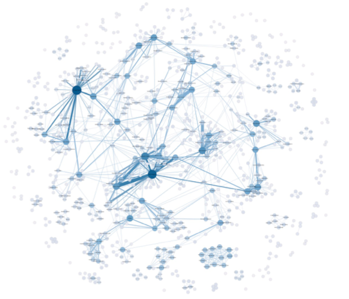

```{r setup, include=FALSE}
options(htmltools.dir.version = FALSE)
knitr::opts_chunk$set(warning = FALSE, message = FALSE)
library(tidyverse) # load tidyverse package
library(emo) # load emoji package
library(igraph)
library(tidygraph)
library(ggraph)
library(here)

```

# Why shouldn't I just use Excel?

- R is a programming language
  - Data live separate from analysis (this is good)
  - Data are imported, manipulated, represented, but not changed.
    - This means you can't screw up!
--

.center[Or at least it is hard to screw up

#`r emo::ji("doubt")`]

---
# R is good for... 

- Data cleaning
- Plotting
- Summarizing
- Manipulating data
- Reproducibility
- Sharing Code

---
class: center, middle

# Foundations of Network Analysis

---
# What is a network?
.pull-left[
- Collection of *object-like* things that are connected.
    - Nodes/actors = Object-like things (Nouns)
        - Students in a class, Words in a novel, Banks...
        - Nodes can have attributes 
            - Gender, 
            - Word-type,
            - Market capitialization
]


.pull-right[


]
---
# What is a network?
.pull-left[
- Collection of *object-like* things that are connected.
    - Ties/Links/Edges = Connections between nodes (Verbs)
        - Talked to each other, Are neigbors, Lend money, Sent text message...
            - Directional
            - Multiplex
            - Weighted
]


.pull-right[


]
---
# Network Analysis is for the analysis of *relational data*

There are four basic assumptions:

1. Nodes and interactions are interdependent*
2. Edges allow flow between nodes
3. Network models on indiviuals both constrain and provide opportunity for action
4. Network models conceptualize structure as representation of lasting patterns of relations between actors

.footnote[
\* Violates basic assumption of inferential statistics

Wasserman, S., Faust, K. (1994). Social network analysis: Methods and applications (Vol. 8). Cambridge university press.
]
---
# What can we do with it?

.pull-left[
### Ego-Level Analyses

- What can we know about the network of one person?
    - Ego density
    - Number of neighbors
    - Number of connected neighbors
]

.pull-right[


]
---

# What can we do with it?

.pull-left[
### Node-Level Analyses

- What can we know about the position of people in a network?
    - Degree (In/Out/Total)
    - Geodesic Distance (Kevin Bacon)
    - PageRank
    - Target Entropy
]

.pull-right[


]
---

# What can we do with it?

.pull-left[
### Whole Network Analyses

- What can we say about a whole network?
    - Density, Average path length, Giant component
    - Clustering
    - Homophily
    - Modeling
        - Block models
        - Small worldness
]

.pull-right[

]
---


# Historical Foundations

.pull-left[

Joseph Moreno & Helen Hall Jennings (1932)
- Established foundations of SNA

Quantitative Sociology/Anthropology
- Davis Southern Women's Club (1941)
- Small World Problem (1967)
- Zachary's Karate Club (1977)

Seminal Articles
- Milgram, Stanley "The small world problem" Psychology Today 2:1, (1967)
- Grannovetter, Mark S. "The strength of weak ties" American Journal of Sociology (1973)
]

.pull-right[

]
---
# Modern Foundations of Network Analysis


### Sociophysics (1990s)

- Graph theory
- Information theory
- Computing 
- Used to study
    - Internet
    - Power grid
    - Transportation networks

Seminal Articles
- Watts & Strogratz "Collective dynamics of small world networks" Nature (1998)
- Page, Brin, Motwani, & Winograd "The PageRank citation ranking: Bringing order to the web" Stanford InfoLab (1999)

---
# Important Takeaways from History
Two main camps

--

Statistical -> hypothesis testing

--

Graph theoretic -> network models and simulation
 
--

.font150.center[
They often don't agree.

There is often distain.

They have different language, journals, conferences
]
---
# Network Data in R

.center[
## Sociomatrix/Adjacency Matrix
]
.pull-left[
```{r ToyNet, echo = FALSE}

set.seed(867)
gr <- erdos.renyi.game(5, 5, type = "gnm")

plot(gr)

A <- as_adjacency_matrix(gr)
```
]

.pull-right[
```{r ToyNetMatrix, echo=FALSE}
A
```
]

---
# Network Data in R

.center[
## Edgelist
]
.pull-left[
```{r PlotToyNet, echo = FALSE}

plot(gr)

B = as_adj_edge_list(gr)
```
]

.pull-right[
```{r ToyNetEdgelist, echo=FALSE}
B
```
]

---

# What does this mean in terms of learning R?

- We need to know something about the different types of data!

.pull-left[

#### Data types (at least some of them)

- **Logical** (T/F, 1/0)
- **Integers** (whole numbers)
- **Numeric** (numbers with decimal places)
- **Complex** (I never use these)
]

.pull-right[
#### Data storage (at least some of them)

- **Vectors** = long columns of data (can be any type, but only one type of data)
- **Dataframes** = like Excel pages (columns can hold different types of data)
- **Matrices** = like dataframes, but they have named rows/columns 
    - Adjacency Matrices are of type matrix.
- **Lists** = the junkdrawer, can hold any type of data (including dataframes or matrices)
    - in igraph, networks are stored as lists.

]
---
# What you need to know about R?

- R is the programming language.
- RStudio is the Integrated Development Environment (IDE)
- Packages: groups of functions that are developed as open source 
- Base R
    - The group of packages preloaded into R
- Tidyverse
    - Family of packages that are designed with the theory that programming should be readable by humans.
- igraph
    - Package that is very useful for doing network analyses


.font190[.center[Lets do this!]]


---
# Using R and RStudio

.pull-left[
- Open RStudio (this will automatically open R)
- Navigate to your folder titled "RForSNA"
- In RStudio -> File -> New Project
    - Select "Existing Directory" (Unless you know Git)
- In RStudio -> File -> New File -> RMarkdown
- Save this file in the folder titled "RForSNA"
]
.pull-right[


]
---

# Lets Take a Tour of RStudio IDE

---

# Let's Install Some Packages
.font150[You'll only need to do this once.]

## In Console

To install tidyverse package...

```{r InstallPackages, eval=FALSE}
install.packages("tidyverse")
```

Repeat this with the following packages:

igraph    tidygraph     here     ggraph

---

# Let's Load Some Packages
.font150[You'll need to do this every time you restart R.]

## In Console

To load tidyverse package...

```{r LoadPackages, eval=FALSE}
library(tidyverse) #tools for cleaning data 
library(igraph)  #package for doing network analysis
library(tidygraph) #tools for doing tidy networks
library(here) #tools for project-based workflow
library(ggraph) #plotting tools for networks
```

--

Once you have done this, you will want to put include a code chunk with all of your libraries into your markdown document so that you don't have to type this every time. 

---
# Let's get data into R. 

I've sent you a csv file that includes the data for workshop 1, I hope you saved this in your folder titled "data". 

If you have loaded the package "here" this should just work.  If you have not loaded the "here" package you will need to set the working directory. 

Again, you will want to include this as a code chunk in your RMD file.  

```{r ReadData, eval=FALSE}
#This loads the csv and saves it as a dataframe titled WorkshopData

WorkshopData <- read_csv(here("data", "AnonSurveyData.csv"))

```

```{r ReadDataForReal, echo = FALSE}
#This loads the csv and saves it as a dataframe titled WorkshopData

WorkshopData <- read_csv(here("static/slides/RForSNA/data", "AnonSurveyData.csv"))

```

---
# Let's have a look at the data

```{r GlimpseData}
glimpse(WorkshopData)

```


---
# Let's start cleaning up.

## First, we don't need most of that data

There is a ton of data there that doesn't make sense for us to keep around. 

We will use the '%>%' (pipe) operator and the verb select

```{r DeleteUnNeededVariables}
WorkshopData %>%
  select(ID,Q2:Q6) -> WorkshopData #<<

glimpse(WorkshopData)
```

???
Note the data are not numbers.
---
# Let's start cleaning up.

## Now we should actually take a look at the data

```{r DataHead}
WorkshopData %>%
  head()
```


---
# Let's check out the power of R

.font200[.center[I am going to blast through these next slides, to show you some of the things that you might want to do with R]]


---
# Let's start visualizing the data

## For categorical data, you might want to get some counts.

Here is code to do this for the question about morning or night person.


```{r MorningOrNight}

WorkshopData %>%
  select(Q2) %>%  #<<
  group_by(Q2) %>% #<<
  tally() 


```


---
# Let's start visualizing the data

## For categorical data, you might want to get a histogram.

Here is code to do this for the favorite dessert type.

.pull-left[
```{r DessertType}

WorkshopData %>%
  select(Q3) %>%
  group_by(Q3) %>% 
  tally()  

```
]

.pull-right[
```{r DessertTypeHist, out.width= "50%"}

WorkshopData %>%
  select(Q3) %>%
  ggplot(aes(y = Q3)) + 
  geom_bar()

```
]

---
# Let's explore beverage choices

```{r BevChoices}
WorkshopData %>%
  select(ID, Q4) %>%
  head()
```

.font150[Notice, these are *not* tidy data, more than one variable per line]
---
# Let's dummy code the beverage data

.pull-left[
### For **tidy** data we want one value per row

```{r TidyBevChoices}
WorkshopData %>%
  select(ID, Q4) %>%
  separate_rows(Q4, sep = ",") %>% #<<
  head(10)
```

]

.pull-right[
### We can dummy code these

```{r WideTidyBevChoices}
WorkshopData %>%
  select(ID, Q4) %>%
  separate_rows(Q4, sep = ",") %>%
  mutate(Checked = 1) %>% #<<
  pivot_wider(names_from = Q4, #<<
              values_from = Checked, #<<
              values_fill = 0) #<<

```


]


---
# Let's look at some quantitative data

### First, let's summarize the reading data.

```{r SummarizeBook,}

WorkshopData %>%
  select(Q5) %>%
  summarize(Ave = mean(Q5, na.rm = TRUE), 
            SD = sd(Q5, na.rm = TRUE))

```


---
# Let's investigate groups

.pull-left[
### Are morning people or night owls reading longer books?

```{r ReadersTimeOfDay}

WorkshopData %>%
  select(Q2, Q5) %>%
  group_by(Q2) %>%
  summarize(Ave = mean(Q5), #<<
            SD = sd(Q5)) #<<

```
]
.pull-right[

### We might want to use a boxplot to display these data

```{r ReadersTimeOfDayBoxplot, out.width = "70%"}

WorkshopData %>%
  select(Q2, Q5) %>%
  ggplot(., aes(x = Q2, y = Q5)) +
  geom_boxplot()

```
]

---
# Let's look at readers vs. blueberries

### Is there a relationship between length of book and estimates on number of blueberries?

.pull-left[
### Could do a scatter plot
```{r ScatterPlot, fig.show= 'hide'}

WorkshopData %>%
  select(Q5:Q6) %>%
  mutate(Q5 = as.numeric(Q5), Q6 = as.numeric(Q6)) %>%
  ggplot(aes(x = Q5, y = Q6)) +
  geom_point()

```

]
.pull-right[
```{r ref.label= 'ScatterPlot', echo=FALSE}

```

]

---
# Let's look at readers vs. blueberries

### Is there a relationship between length of book and estimates on number of blueberries?

### Or you could do a linear model

```{r LinearModel}

summary(lm(Q6 ~ Q5, data = WorkshopData))

```
---
# Let's prep our data for SNA

### We will need to prep two separate files...

1. An edgelist
2. A file of attributes of the nodes. 

---
# Let's make an edgelist


There is an issue here. 

I wanted to make these data anonymous (so we don't know who likes scotch)

But to do that I had to make the edgelist for you. 

So I sent you an edgelist as a csv. Sorry.


### Check out the edgelist
```{r GenerateEL, eval=FALSE}
EL = read_csv(here("data", "AnonEL.csv"))
head(EL)
```

```{r GenerateELForReal, echo=FALSE}
EL = read_csv(here("/static/slides/RForSNA/data", "AnonEL.csv"))
head(EL)
```


---
# Let's assemble our node attributes

Before we can convert our Edgelist to a network, we should add in the attributes. 

We have several candidate attributes:
- Morning vs. Night
- Dessert Type
- Pages in book

We will develop a separate dataframe for the attributes. 

```{r Attributes}
WorkshopData %>%
  select(ID, Q2, Q3, Q5) -> AttributeDf
```


---
# Let's assemble our node attributes

Experience tells me that when you try to add attributes that you often make a mistake where the number attributes don't match up well to the number of nodes...but lets see.


```{r AssembleGraph, out.width= "40%"}

gr <- graph_from_data_frame(EL, directed = TRUE)

plot(gr)


gr = as_tbl_graph(gr)

```


---
# Let's add some attributes

So actually the easiest way to add the attributes is to add them while you make the graph.  

But that isn't as easy as it seems

```{r GraphWAttributes1, warning=TRUE, eval=FALSE}

gr %>%
  activate(nodes) %>%
  mutate(AMPM = AttributeDf$Q2)

```
But that isn't as easy as it seems...


--- 
# Let's sort out these attributes. 


The warning was: "Input `AMPM` must be size 60 or 1, not 34."

What this means is we need to take our attributes dataframe and make sure all the nodes are listed. 

To do this we need to:
- Compile a dataframe of all nodes listed in the graph
- Use a join to add attributes to this dataframe

---
# Let's sort out these attributes (pt 2)

```{r GraphWAttributes2}
#This will get a vector of all nodes
gr %>%
  activate(nodes) %>%
  as_tibble() %>%
  transmute(ID = name) %>%
  mutate(ID = as.numeric(ID))-> GrNodes

#Now we pull in the attributes using a left_join
NodeAttributes = left_join(GrNodes, AttributeDf, by = "ID")
```

You should inspect Node Attributes

---
# Let's sort out these attributes (pt 3)


### Inspect the head

```{r GraphWAttributes3}

head(NodeAttributes)

```

---
# Let's sort out these attributes (pt 4)

### Inspect the tail

```{r GraphWAttributes4}

tail(NodeAttributes)

```


---
# Let's finally assemble this graph. 

```{r BuildGraph}

gr %>%
  as_tbl_graph() %>%
  activate(nodes) %>%
  mutate(AMPM = NodeAttributes$Q2) %>%
  mutate(Dessert = NodeAttributes$Q3) %>%
  mutate(Pages = NodeAttributes$Q5) -> gr

summary(gr)
```
---
# Let's finally assemble this graph.

### Take a look at your graph

```{r InspectGr, echo=FALSE}
 gr 
```

---
# Let's make our plots look a bit better
.pull-left[
### We can add various elements to our plot
- Color (good for grouping)
- Shape (good for grouping)
- Size (good for numeric)
- Text (good for labels)
- Layout

### This is the most basic plot
````
```{r PlotGr1, eval = FALSE}
ggraph(gr) +
  geom_edge_link() +
  geom_node_point()
```
````
]

.pull-right[

```{r PlotGr1a, echo=FALSE}
ggraph(gr) +
  geom_edge_link() +
  geom_node_point()
```

Not super pretty
]

---
# Let's make our plots look a bit better
.pull-left[
### We can add various elements to our plot
- Layout, there are lots of options
    -Try circle?

````
```{r PlotGr2, eval = F}
ggraph(gr, layout = 'circle') +
  geom_edge_link() +
  geom_node_point()
```
````
]

.pull-right[
```{r PlotGr2a, echo = F}
ggraph(gr, layout = 'circle') +
  geom_edge_link() +
  geom_node_point()
```
]

---

# Let's make our plots look a bit better

.pull-left[
### We can add various elements to our plot
- Shape, we can make night owls one shape and morning people a differnt shape...

````
```{r PlotGr3, eval = F}
ggraph(gr, layout = 'circle') +
  geom_edge_link() +
  geom_node_point(aes(shape = AMPM))
```
````
]
.pull-right[
```{r PlotGr3a, echo = F}
ggraph(gr, layout = 'circle') +
  geom_edge_link() +
  geom_node_point(aes(shape = AMPM))
```

### Not great

]
---

# Let's make our plots look a bit better

.pull-left[
### We can add various elements to our plot
- Color, lets use the dessert type to define a color

````
```{r PlotGr4,eval=FALSE}
ggraph(gr, layout = 'circle') +
  geom_edge_link() +
  geom_node_point(aes(color = Dessert))
```
````
]
.pull-right[
```{r PlotGr4a, echo=FALSE}
ggraph(gr, layout = 'circle') +
  geom_edge_link() +
  geom_node_point(aes(color = Dessert))
```
]
---

# Let's make our plots look a bit better
.pull-left[
### We can add various elements to our plot
- Size, lets make the nodes different sizes based on the number of pages in the last book read.

````
```{r PlotGr5, eval=FALSE}
ggraph(gr, layout = 'circle') +
  geom_edge_link() +
  geom_node_point(aes(size = Pages))
```
````
]
.pull-right[
```{r PlotGr5a, echo=FALSE}
ggraph(gr, layout = 'circle') +
  geom_edge_link() +
  geom_node_point(aes(size = Pages))
```
]
---

# Let's make our plots look a bit better

.pull-left[
### We can add various elements to our plot
- Let's jam them all together!

````
```{r PlotGr6, eval=FALSE}
ggraph(gr, layout = 'circle') +
  geom_edge_link() +
  geom_node_point(aes(shape = AMPM, 
                      color = Dessert, 
                      size = Pages))
```
````
]

.pull-right[

```{r PlotGr6a, echo=FALSE}
ggraph(gr, layout = 'circle') +
  geom_edge_link() +
  geom_node_point(aes(shape = AMPM, 
                      color = Dessert, 
                      size = Pages))
```

]