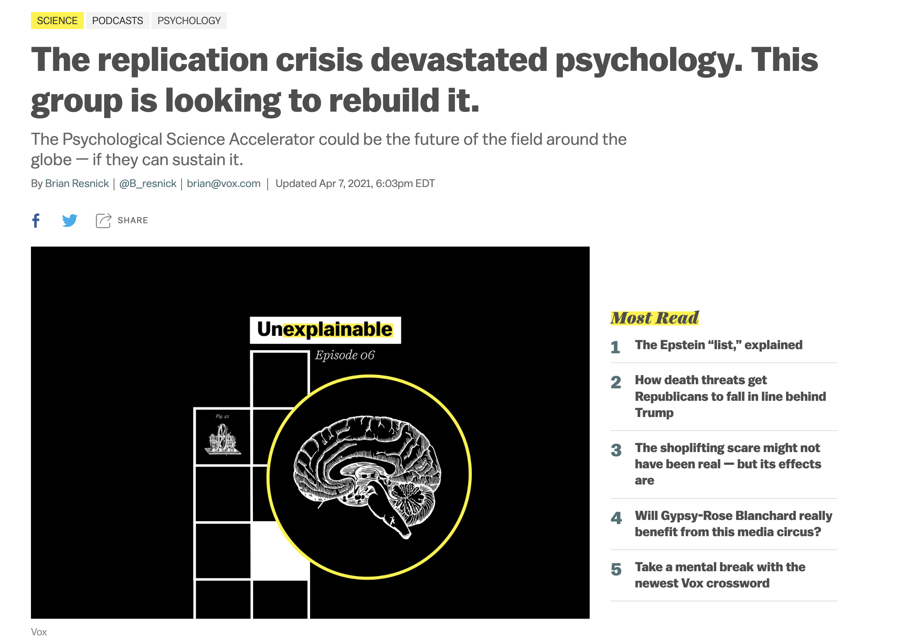

```{r setup, include=FALSE}
options(htmltools.dir.version = FALSE)
knitr::opts_chunk$set(warning = FALSE, message = FALSE)
library(tidyverse) # load tidyverse package
library(emoji) # load emoji package
library(janitor)
library(glmnet)
library(haven)
library(here)

```


---
class: center, middle

# Introduction to this course, R and plotting recipes


---
# Relationships

The basic idea of this course is to understand relationships. 

Specifically, relationships between two (or more) variables.

For Example:
- Height and weight
- Temperature and ice cream consumption
- Average rainfall and happiness

---
# Human relationships

- Humans are weird and complicated! 
- A relationship that we can find is not absolute. 
   - Deterministic relationships: If A then B (ALWAYS)
   - Probabalistic relationships: If A then a tendency to B
   - Rainfall and happiness?

.pull-left[

]
.pull-right[

]

---
# Prediction vs Causation

Two ways to think about relationships...

1. Knowing about A allows you to know more about B (predictive)
2. More of A caused more of B (causal)

---
# Why are we learning coding?

.pull-left[
#### Research Reproducibility

- One idea of science is falsifiability 
]

.pull-right[

]
---

# What you need to know about R?

- R is the programming language.
- RStudio is the Integrated Development Environment (IDE)
- Posit.cloud is an online version of the IDE
- Packages: groups of functions that are developed as open source 
- Base R
    - The group of packages preloaded into R
- Tidyverse
    - Family of packages that are designed with the theory that programming should be readable by humans.


.font190[.center[Lets do this!]]

---

# How do we start learning R?

- We need to know something about the different types of data and the ways in which they are stored. 

.pull-left[

#### Data types (at least some of them)

- **Logical** (T/F, 1/0)
- **Integers** (whole numbers)
- **Numeric** (numbers with decimal places)
- **Complex** (I never use these)
- **Text** (exactly what it sounds like)
]

.pull-right[
#### Data storage (at least some of them)

- **Vectors** = long columns of data (can be any type, but only one type of data)
- **Dataframes** = like Excel pages (columns can hold different types of data)
- **Matrices** = like dataframes, but they have named rows/columns 
    - Adjacency Matrices are of type matrix.
- **Lists** = the junkdrawer, can hold any type of data (including dataframes or matrices)

]
---


# Lets Take a Tour of RStudio IDE

---

# Let's Install Some Packages
.font150[You'll only need to do this once.]

## In Console

To install tidyverse package...

```{r InstallPackages, eval=FALSE}
install.packages("tidyverse")
```

Repeat this with the following packages:

glmnet janitor haven

---

# Let's Load Some Packages
.font150[You'll need to do this every time you restart R.]

## In Console

To load tidyverse package...

```{r LoadPackages, eval=FALSE}
library(tidyverse) #tools for cleaning and visualizing data 
library(janitor)  #package for cleaning data
library(glmnet) #tools for doing regression analyses
library(here) #tools for project-based workflow
library(haven) #tools for reading in data from spss
```

--

Once you have done this, you will want to put include a code chunk with all of your libraries into your markdown document so that you don't have to type this every time. 

---
# Let's get data into R. 

In this workshop, you have the data from the survey to make things as easy as possible. However, this is not typical.  You will have to find ways to get your data into R but that is sort of different depending on where you are running R (posit.cloud or a local machine)

If you have loaded the package "here" this should just work.  If you have not loaded the "here" package you will need to set the working directory. 

Again, you will want to include this as a code chunk in your RMD file.  


```{r ReadDataforReal, echo=FALSE}
#This loads the csv and saves it as a dataframe titled week_1_data

week_1_data <- read_csv(here("static/slides/EDUC_847/data", "EDUC_847_Survey.csv"))

```


```{r ReadData, eval=FALSE}
#This loads the csv and saves it as a dataframe titled week_1_data

week_1_data <- read_csv(here("static/slides/EDUC_847/data",
                             "EDUC_847_Survey.csv"))

```


---
# Let's have a look at the data

```{r GlimpseData}
glimpse(week_1_data)

```


---
# Let's start cleaning up.

## First, we don't need most of that data

There is a ton of data there that doesn't make sense for us to keep around. 

We will use the '%>%' (pipe) operator and the verb select

```{r DeleteUnNeededVariables}
week_1_data %>%
  select(ID,Q2:Q10) -> w1df #<<

glimpse(w1df)
```

???
Note the data are not numbers.
---
# Let's keep cleaning up.

Notice there are two rows of data that are just the questions and something from Qualtrics.  Let's get rid of those. 

```{r RemoveExtraRows}
w1df %>%
  filter(row_number() >3 ) -> w1df

```


---
# Let's start visualizing the data

## For categorical data, you might want to get some counts.

Here is code to do this for the question about morning or night person.


```{r MorningOrNight}

w1df %>%
  select(Q2) %>%  #<<
  group_by(Q2) %>% #<<
  tally() 


```


---
# Let's start visualizing the data

## You might want to see the distribution of our data.

Histograms are very important for regression!

Here is code to do this for the data from above.

.pull-left[
```{r AMPM2}

w1df %>%
  select(Q2) %>%  #<<
  group_by(Q2) %>% #<<
  tally() 


```
]

.pull-right[
```{r AMPMHist, out.width= "50%", eval=FALSE}

w1df %>%
  hist(Q2) #<<

```
]


---
# Let's start visualizing the data

## You might want to see the distribution of our data.

Histograms are very important for regression!

Here is code to do this for the data from above.

.pull-left[
```{r AMPM3}

w1df %>%
  select(Q2) %>%  #<<
  group_by(Q2) %>% #<<
  tally() 


```
]

.pull-right[
```{r AMPMHist2, out.width= "50%"}

w1df %>%
  mutate(Q2 = as.numeric(Q2)) -> w1df #<<
  
hist(w1df$Q2)

```
]

Thats kind of ugly! Lets make it look better.


---
# Let's make the histogram look better


.pull-left[
```{r AMPM4}

w1df %>%
  select(Q2) %>%  #<<
  group_by(Q2) %>% #<<
  tally() 


```
]

.pull-right[
```{r AMPMHist3, out.width= "50%"}

w1df %>%
  select(Q2) %>%
  ggplot(aes(y = Q2)) + #<<
  geom_bar()


```
]

That's a little better?


---
# Let's make the histogram even better


.pull-left[
```{r AMPM5}

w1df %>%
  select(Q2) %>%  #<<
  group_by(Q2) %>% #<<
  tally() 


```
]

.pull-right[
```{r AMPMHist4, out.width= "50%"}

w1df %>%
  select(Q2) %>%
  ggplot(aes(y = Q2)) + 
  geom_bar() + 
  theme_minimal() + #<<
  ggtitle("Histogram of morning/night") #<<


```
]

Good enough for now...you are always welcome to continue adding layers to your plot to make it look even better.  
See here for more: https://ggplot2.tidyverse.org/

---
# Let's look at some quantitative data

### First, let's summarize the book data.

```{r SummarizeBook}

w1df %>%
  select(Q5) %>%
  mutate(Q5 = as.numeric(Q5)) %>%
  summarize(Ave = mean(Q5, na.rm = TRUE), #<<
            SD = sd(Q5, na.rm = TRUE)) #<<

```


---
# Let's tidy up a bit

I find it annoying to have to convert the data to numeric all the time.

```{r ConvertData}

w1df %>%
  mutate(Q3 = as.numeric(Q3)) %>%
  mutate(Q5 = as.numeric(Q5)) %>%
  mutate(Q6 = as.numeric(Q6)) -> w1df

glimpse(w1df)

```

---
# Let's investigate groups

.pull-left[
### Do morning people or night owls have longer books nearby?

```{r BooksTimeOfDay}

w1df %>%
  select(Q2, Q5) %>%
  group_by(Q2) %>%
  summarize(Ave = mean(Q5), #<<
            SD = sd(Q5)) #<<

```
]
.pull-right[

### We might want to use a boxplot to display these data

```{r BooksTimeOfDayBoxplot, out.width = "100%"}

w1df %>%
  select(Q2, Q5) %>%
  mutate(Q2 = as.character(Q2)) %>% #Just this once!
  ggplot(., aes(x = Q2, y = Q5)) + #<<
  geom_boxplot()

```
]

---
# Let's look at books vs. weight of cow

### Is there a relationship between length of book and estimates on weight of cow?

.pull-left[
### Could do a scatter plot
```{r ScatterPlot, fig.show= 'hide'}

w1df %>%
  select(Q5:Q6) %>%
  ggplot(aes(x = Q5, y = Q6)) +
  geom_point()

```

]

.pull-right[
```{r ref.label= 'ScatterPlot', echo=FALSE}

```

]

---
# Let's make our scatter plot look better


.pull-left[
### Could do a scatter plot
```{r ScatterPlot2, fig.show= 'hide'}

w1df %>%
  select(Q5:Q6) %>%
  ggplot(aes(x = Q5, y = Q6)) +
  geom_point() + 
  theme_minimal() + 
  labs(x = "Pages", 
       y = "Weight of Cow",
       title = "Kick Ass Scatterplot!")

```

]

.pull-right[
```{r ref.label= 'ScatterPlot2', echo=FALSE}

```

]

---
# Let's use some colors

What if Morning People have different relationships between the estimates of cow weight and length of the closest book.

.pull-left[
### Could do a scatter plot
```{r ScatterPlot3, fig.show= 'hide'}

w1df %>%
  select(Q2,Q5:Q6) %>%
  ggplot(aes(x = Q5, y = Q6, color = Q2)) +
  geom_point() + 
  theme_minimal() + 
  labs(x = "Pages", 
       y = "Weight of Cow",
       title = "Scatterplot!")

```

]

.pull-right[
```{r ref.label= 'ScatterPlot3', echo=FALSE}

```

]

---
# Let's recap

- We know how to get data into R
- We know how to modify the data
- We know how to plot the data
- We have recipes for plotting 
    - histograms
    - boxplots
    - scatterplots
    
We are ready to go!
    