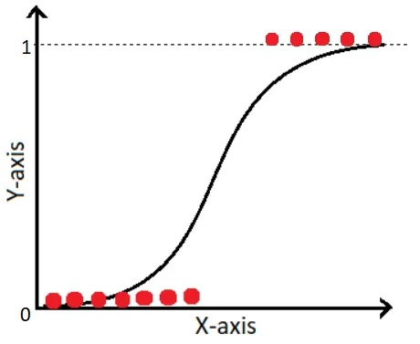
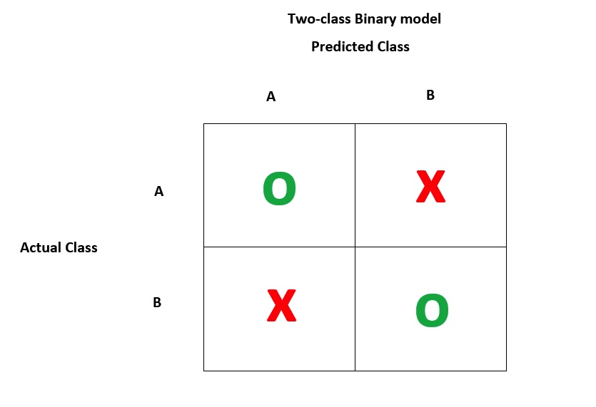

```{r setup, include=FALSE}
options(htmltools.dir.version = FALSE)
knitr::opts_chunk$set(warning = FALSE, message = FALSE)
library(tidyverse)
library(janitor)
library(haven)
library(here)
library(broom)
library(mice)
library(car)
library(jtools)
library(kableExtra)
library(broom.mixed)
library(emdi)
library(interactions)
library(caret)

```


# Let's start with a complete dataset

Start by getting the data into R

```{r ReadDataforReal, echo=FALSE}

sci_df <- read_csv(here("static/slides/EDUC_847/data", "sci_scores.csv"))

```


```{r ReadData, eval=FALSE}
#This loads the csv and saves it as a dataframe titled sci_df

sci_df <- read_csv(here("data",
                        "sci_scores.csv"))

```


---
# Let's remember last class

### We predicted science scores from scores. 
```{r LinearRegression}

sci_mod_motiv <- lm(sci ~ motiv, data = sci_df) #<<

tidy(summary(sci_mod_motiv))
```

Note - we have a new dataset, there is a passing variable.

---
# Let's go futher

## What if we wanted to then predict who would pass some class. 

### Probably need to look at our data


```{r ReviewData}

glimpse(sci_df)

```

---
# Let's review passing data 

```{r}
sci_df %>%
  tabyl(pass)
```

### We need to be able to predict better than 64%
---
# Let's plot 

## We can try a scatter plot

.pull-left[

```{r scatterplotL, eval=FALSE}
sci_df %>%
  ggplot(aes(x = motiv, y = pass)) +
  geom_point()

```

]
.pull-right[

```{r scatterplotR, echo=FALSE}
sci_df %>%
  ggplot(aes(x = motiv, y = pass)) +
  geom_point()

```

]
---
# Let's plot 

## Boxplots should be better

.pull-left[
```{r boxplotL, eval=FALSE}
sci_df %>%
  ggplot(aes(x = as.factor(pass), y = motiv)) +
  geom_boxplot()

```
]
.pull-right[
```{r boxplotR, echo=FALSE}
sci_df %>%
  ggplot(aes(x = as.factor(pass), y = motiv)) +
  geom_boxplot()

```
]
---
# Let's predict passing

## Here's what we know:

- Pass / Fail is a binary outcome variable
- We have a variety of types of predictor variables

### Regular linear regression won't work.

---
# Let's look at Logistic Regression

.pull-left[

## Goal of logistic regression is to predict a binary outcome

* Linear regression 
  - fit a slope to a data set.

* Logistic regression
 - fit a logit to a data set.

]
.pull-right[



]

---
# Let's look at motivation
.pull-left[
```{r LogitMotivL, eval=FALSE}
sci_df %>%
  ggplot(aes(x = motiv, y = pass)) +
  geom_point() +
  geom_smooth(method = "glm", 
    method.args = list(family = "binomial"), 
    se = FALSE)
```
]
.pull-right[
```{r LogitMotivR, echo=FALSE}
sci_df %>%
  ggplot(aes(x = motiv, y = pass)) +
  geom_point() +
  geom_smooth(method = "glm", 
    method.args = list(family = "binomial"), 
    se = FALSE)
```
]

---
# Let's do some math!

## The logistic funcion is: 
$\sigma(x) = \frac{1}{1+e^{-x}}$

### It has some important properties
- it has a value between 0 and 1 for any value of x

---
# Let's do some math!

## We can adapt this to a regression equation
$p(x) = \frac{1}{1+e^{-(\beta_{0}+\beta_{1}x+...)}}$

We interpret this as the probablility of the outcome variable, so in our case, it is the probability of passing.  And by definition, the probability of failing the class is then $1 - p(x)$

This means that the ratio of passing to failing is

$\frac{p(x)}{1-p(x)} = e^{\beta_{0} + \beta_{1}x+...}$

### Why does this matter? 
We'll need to interpret the outcome of the regression.

---
# Let's do logistic regression!

```{r LogisticReg}

pass_model <- glm(pass~motiv, data = sci_df, family = "binomial") #<<

summary(pass_model)
```


---
# Let's interpret

```{r ViewCoeff}
coef(pass_model)
```

But to interpret, we need to take the exp of the coefficient (because this is an log odds ratio)

```{r ExpCoeff}
exp(coef(pass_model)[2])
```

This means for every increase in motivation score, the odds of passing the class increase by ~8%.  That seems meaningful. But how did we do?  Is this better at predicting passing?


---
# Let's evaluate

## A typical approach is to use a confusion matrix.



---
#Let's build a confusion matrix

First, we will use the predict function to generate predicted probabilities of passing. 

```{r ConfusionMatrix}
predicted <- tibble( probs = predict(pass_model, type = "response"))

head(predicted)

```

But those are numbers, how do we convert to pass/fail?


---
#Let's build a confusion matrix

First, we will use the predict function to generate predicted probabilities of passing. 

```{r ConfusionMatrix2}
predicted %>%
  mutate(pred_50 = if_else(probs>0.5,1,0)) %>%
  mutate(pred_64 = if_else(probs>0.64,1,0))  -> predictions

head(predictions, 10 )
```

---
#Let's build a confusion matrix for the 50%


```{r ConfusionMatrix3L }
confusionMatrix(as.factor(sci_df$pass),as.factor(predictions$pred_50))
```


---
#Let's build a confusion matrix for the 64%

```{r ConfusionMatrix4}
confusionMatrix(as.factor(sci_df$pass),as.factor(predictions$pred_64))
```

---
# Let's define some terms


**Sensitivity**: True Positive Rate - what percent of people did we predict would pass that actually did pass?

**Specificity**: True Negative Rate - what percent of people did we predict would fail that actually did fail?

**Precision**: Out of the people we predicted to pass, what percent actually did pass?

**Recall**: Out of the people that did pass, what percent did we predict to pass? 

---
# Let's review

We spent today looking at how to use logistic regression

We can...
 - create a logistic regression model
 - interpret logistic regression coefficients
 - use a confusion matrix to evaluate the predictive power of the model
