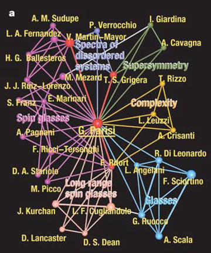
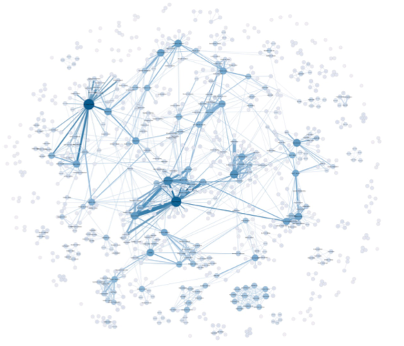
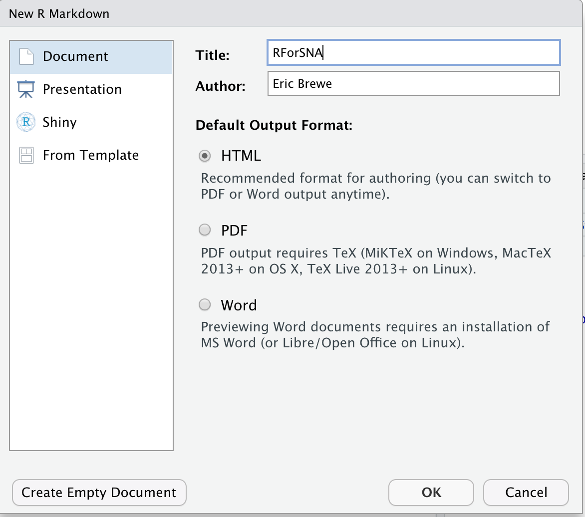

```{r setup, include=FALSE}
options(htmltools.dir.version = FALSE)
knitr::opts_chunk$set(warning = FALSE, message = FALSE)
library(tidyverse) # load tidyverse package
library(emo) # load emoji package
library(igraph)
library(tidygraph)
library(ggraph)
library(here)

```

# Why shouldn't I just use Excel?

- R is a programming language
  - Data live separate from analysis (this is good)
  - Data are imported, manipulated, represented, but not changed.
    - This means you can't screw up!
--

.center[Or at least it is hard to screw up

#`r emo::ji("doubt")`]

---
# R is good for... 

- Data cleaning
- Plotting
- Summarizing
- Manipulating data
- Reproducibility
- Sharing Code

---
class: center, middle

# Foundations of Network Analysis

---
# What is a network?
.pull-left[
- Collection of *object-like* things that are connected.
    - Nodes/actors = Object-like things (Nouns)
        - Students in a class, Words in a novel, Banks...
        - Nodes can have attributes 
            - Gender, 
            - Word-type,
            - Market capitialization
]


.pull-right[


]
---
# What is a network?
.pull-left[
- Collection of *object-like* things that are connected.
    - Ties/Links/Edges = Connections between nodes (Verbs)
        - Talked to each other, Are neigbors, Lend money, Sent text message...
            - Directional
            - Multiplex
            - Weighted
]


.pull-right[


]
---
# Network Analysis is for the analysis of *relational data*

There are four basic assumptions:

1. Nodes and interactions are interdependent*
2. Edges allow flow between nodes
3. Network models on indiviuals both constrain and provide opportunity for action
4. Network models conceptualize structure as representation of lasting patterns of relations between actors

.footnote[
\* Violates basic assumption of inferential statistics

Wasserman, S., Faust, K. (1994). Social network analysis: Methods and applications (Vol. 8). Cambridge university press.
]
---
# What can we do with it?

.pull-left[
### Ego-Level Analyses

- What can we know about the network of one person?
    - Ego density
    - Number of neighbors
    - Number of connected neighbors
]

.pull-right[


]
---

# What can we do with it?

.pull-left[
### Node-Level Analyses

- What can we know about the position of people in a network?
    - Degree (In/Out/Total)
    - Geodesic Distance (Kevin Bacon)
    - PageRank
    - Target Entropy
]

.pull-right[


]
---

# What can we do with it?

.pull-left[
### Whole Network Analyses

- What can we say about a whole network?
    - Density, Average path length, Giant component
    - Clustering
    - Homophily
    - Modeling
        - Block models
        - Small worldness
]

.pull-right[

]
---


# Historical Foundations

.pull-left[

Joseph Moreno & Helen Hall Jennings (1932)
- Established foundations of SNA

Quantitative Sociology/Anthropology
- Davis Southern Women's Club (1941)
- Small World Problem (1967)
- Zachary's Karate Club (1977)

Seminal Articles
- Milgram, Stanley "The small world problem" Psychology Today 2:1, (1967)
- Grannovetter, Mark S. "The strength of weak ties" American Journal of Sociology (1973)
]

.pull-right[

]
---
# Modern Foundations of Network Analysis


### Sociophysics (1990s)

- Graph theory
- Information theory
- Computing 
- Used to study
    - Internet
    - Power grid
    - Transportation networks

Seminal Articles
- Watts & Strogratz "Collective dynamics of small world networks" Nature (1998)
- Page, Brin, Motwani, & Winograd "The PageRank citation ranking: Bringing order to the web" Stanford InfoLab (1999)

---
# Important Takeaways from History
.center[Two main camps

--

Statistical -> hypothesis testing

--

Graph theoretic -> network models and simulation]
 
--

.font200.center[
They often don't agree.

There is often distain.

They have different language, journals, conferences
]]
---
# Network Data in R

.center[
## Sociomatrix/Adjacency Matrix
]
.pull-left[
```{r ToyNet, echo = FALSE}

set.seed(867)
gr <- erdos.renyi.game(5, 5, type = "gnm")

plot(gr)

A <- as_adjacency_matrix(gr)
```
]

.pull-right[
```{r ToyNetMatrix, echo=FALSE}
A
```
]

---
# Network Data in R

.center[
## Edgelist
]
.pull-left[
```{r PlotToyNet, echo = FALSE}

plot(gr)

B = as_adj_edge_list(gr)
```
]

.pull-right[
```{r ToyNetEdgelist, echo=FALSE}
B
```
]

---

# What does this mean in terms of learning R?

- We need to know something about the different types of data!

.pull-left[

#### Data types (at least some of them)

- **Logical** (T/F, 1/0)
- **Integers** (whole numbers)
- **Numeric** (numbers with decimal places)
- **Complex** (I never use these)
]

.pull-right[
#### Data storage (at least some of them)

- **Vectors** = long columns of data (can be any type, but only one type of data)
- **Dataframes** = like Excel pages (columns can hold different types of data)
- **Matrices** = like dataframes, but they have named rows/columns 
    - Adjacency Matrices are of type matrix.
- **Lists** = the junkdrawer, can hold any type of data (including dataframes or matrices)
    - in igraph, networks are stored as lists.

]
---
# What you need to know about R?

- R is the programming language.
- RStudio is the Integrated Development Environment (IDE)
- Packages: groups of functions that are developed as open source 
- Base R
    - The group of packages preloaded into R
- Tidyverse
    - Family of packages that are designed with the theory that programming should be readable by humans.
- igraph
    - Package that is very useful for doing network analyses


.font190[.center[Lets do this!]]


---
# Using R and RStudio

.pull-left[
- Open RStudio (this will automatically open R)
- Navigate to your folder titled "RForSNA"
- In RStudio -> File -> New Project
    - Select "Existing Directory" (Unless you know Git)
- In RStudio -> File -> New File -> RMarkdown
- Save this file in the folder titled "RForSNA"
]
.pull-right[


]
---

# Lets Take a Tour of RStudio IDE

---

# Let's Install Some Packages
.font150[You'll only need to do this once.]

## In Console

To install tidyverse package...

```{r InstallPackages, eval=FALSE}
install.packages("tidyverse")
```

Repeat this with the following packages:

igraph    tidygraph     here     ggraph

---

# Let's Load Some Packages
.font150[You'll need to do this every time you restart R.]

## In Console

To load tidyverse package...

```{r LoadPackages, eval=FALSE}
library(tidyverse) #tools for cleaning data 
library(igraph)  #package for doing network analysis
library(tidygraph) #tools for doing tidy networks
library(here) #tools for project-based workflow
library(ggraph) #plotting tools for networks
```

--

Once you have done this, you will want to put include a code chunk with all of your libraries into your markdown document so that you don't have to type this every time. 

---
# Let's get data into R. 

I've sent you a csv file that includes the data for workshop 1, I hope you saved this in your folder titled "data". 

If you have loaded the package "here" this should just work.  If you have not loaded the "here" package you will need to set the working directory. 

Again, you will want to include this as a code chunk in your RMD file.  

```{r ReadData, eval=FALSE}
#This loads the csv and saves it as a dataframe titled WorkshopData

WorkshopData <- read_csv(here("data", "DataForWorkshop1.csv"))

```
```{r ReadDataForReal, echo = FALSE}
#This loads the csv and saves it as a dataframe titled WorkshopData

WorkshopData <- read_csv(here("static/slides/RForSNA/data", "DataForWorkshop1.csv"))

```

---
# Let's have a look at the data

```{r GlimpseData}
glimpse(WorkshopData)

```

---
# Let's start cleaning up.

## First, we don't need most of that data

There is a ton of data there that doesn't make sense for us to keep around. 

We will use the '%>%' (pipe) operator and the verb select

```{r DeleteUnNeededVariables}
WorkshopData %>%
  select(ResponseId,Q2:Q7) -> WorkshopData

glimpse(WorkshopData)
```

???
Note the data are not numbers.
---
# Let's start cleaning up.

## Now we should actually take a look at the data

```{r DataHead}
WorkshopData %>%
  head()
```
--
Hmm, it looks like there are two rows that are not actually data. 

---
# Let's start cleaning up.

## Get rid of the two rows of data that are junk

```{r RemoveTwoRows}
WorkshopData %>%
  slice(-(1:2))
```

--
### Since this worked, we should now update our dataframe

---
# Let's start cleaning up.

## Get rid of the two rows of data that are junk

```{r RemoveTwoRowsAndSave}
WorkshopData %>%
  slice(-(1:2)) -> WorkshopData #<<

WorkshopData
```

--
### Full disclosure I had to google how to do this

---
# Let's check out the power of R

.font200[.center[I am going to blast through these next slides, to show you some of the things that you might want to do with R]]


---
# Let's start visualizing the data

## For categorical data, you might want to get some counts.

Here is code to do this for the question about morning or night person.


```{r MorningOrNight}

WorkshopData %>%
  select(Q2) %>%  #<<
  group_by(Q2) %>% #<<
  tally() 


```


---
# Let's start visualizing the data

## For categorical data, you might want to get a histogram.

Here is code to do this for the favorite dessert type.

.pull-left[
```{r DessertType}

WorkshopData %>%
  select(Q3) %>%
  group_by(Q3) %>% 
  tally()  

```
]
.pull-right[
```{r DessertTypeHist}

WorkshopData %>%
  select(Q3) %>%
  ggplot(aes(y = Q3)) + 
  geom_bar()

```
]

---
# Let's look at some quantitative data
.pull-left[
### First, let's summarize the reading data.

```{r SummarizeBook}

WorkshopData %>%
  select(Q5) %>%
  summarize(Ave = mean(Q5), 
            SD = sd(Q5))

```
#### If we just run this we get an error message. 
* It is weird that sd will run, but mean will not. 

]

.pull-right[
### Convert to numeric

(mutate is a verb that is really useful!)

```{r SummarizeBookNum}

WorkshopData %>%
  select(Q5) %>%
  mutate(Q5 = as.numeric(Q5)) %>% #<<
  summarize(Ave = mean(Q5, na.rm = TRUE), 
            SD = sd(Q5, na.rm = TRUE))

```
]

```{r ConvertToNumeric, echo=FALSE}

#WorkshopData %>%
#  mutate(Q5 = as.numeric(Q5),
#         Q6 = as.numeric(Q6)) -> WorkshopData
  
```

---
# Let's investigate groups

.pull-left[
### Are morning people or night owls reading longer books?

```{r ReadersTimeOfDay}

WorkshopData %>%
  select(Q2, Q5) %>%
  mutate(Q5 = as.numeric(Q5)) %>%
  group_by(Q2) %>%
  summarize(Ave = mean(Q5, na.rm = TRUE), 
            SD = sd(Q5, na.rm = TRUE))

```
]
.pull-right[

### We might want to use a boxplot to display these data

```{r ReadersTimeOfDayBoxplot}

#WorkshopData %>%
#  select(Q2, Q5) %>%
#  mutate(Q5 = as.numeric(Q5)) %>%
#  group_by(Q2) %>%
#  boxplot()

```
]

---
# Let's look at readers vs. blueberries

### Is there a relationship between length of book and estimates on number of blueberries?

.pull-left[
Could do a scatter plot
```{r ScatterPlot, fig.show= 'hide'}

WorkshopData %>%
  select(Q5:Q6) %>%
  mutate(Q5 = as.numeric(Q5), Q6 = as.numeric(Q6)) %>%
  ggplot(aes(x = Q5, y = Q6)) +
  geom_point()

```

]
.pull-right[
```{r ref.label= 'ScatterPlot', echo=FALSE}

```

]

---
# Let's look at readers vs. blueberries

### Is there a relationship between length of book and estimates on number of blueberries?

### Or you could do a linear model

```{r LinearModel}

summary(lm(Q6 ~ Q5, data = WorkshopData))

```
---
# Let's prep our data for SNA

We will need to prep two separate files...

1. An edgelist
2. A file of attributes of the nodes. 

---
# Let's make an edgelist

### First, take a look at the data

```{r GlimpseQ7}

WorkshopData %>%
  select(ResponseId, Q7) %>%
  glimpse()

```

The data are organized so that we have the IDs of the people that are connected separated by commas.  It would be best if we could separate these into separate rows.


---
# Let's make an edgelist

### Separate connection data so we have one row per interaction

```{r SeparateQ7}

WorkshopData %>%
  select(ResponseId, Q7) %>%
  separate_rows(Q7) -> EL

head(EL)

```

.font140[
Since I want to use this Edgelist over and over, I will assign it to a new dataframe
] 

---
# Let's make an edgelist

The issue with the edgelist as a data frame is that the command we want to use needs the edgelist to be a matrix. So we need to convert.

```{r ConvertEdgelistToMatrix}

EL_M = as.matrix(EL)

dim(EL_M)

```

---
# Let's assemble our node attributes

Before we can convert our Edgelist to a network, we should add in the attributes. 

We have several candidate attributes:
- Morning vs. Night
- Dessert Type
- Pages in book
- Beverages (But this is much harder to deal with)

We will develop a separate dataframe for the attributes. 

```{r Attributes}
WorkshopData %>%
  select(ResponseId, Q2, Q3, Q5) -> AttributeDf
```


---
# Let's assemble our node attributes

Experience tells me that when you try to add attributes


